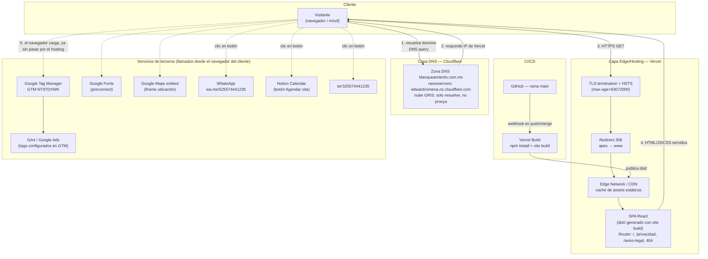

# Blanqueamiento Dental Center — Landing page

Sitio de marketing (una sola landing + páginas legales) para la clínica dental
"Blanqueamiento Dental Center" en CDMX. Pensado para campañas de Google Ads:
SEO on-page, datos estructurados, Google Tag Manager y páginas de privacidad/aviso
legal. No tiene backend propio ni base de datos — es un sitio estático.

- Producción: https://www.blanqueamiento.com.mx/

## Stack

| Capa | Tecnología |
|---|---|
| Framework | React 18 + TypeScript |
| Build tool | Vite (plugin `@vitejs/plugin-react-swc`) |
| UI | shadcn/ui sobre Radix UI, Tailwind CSS |
| Routing | React Router (`react-router-dom`) |
| Formularios | React Hook Form + Zod |
| Tests unitarios | Vitest + Testing Library (jsdom) |
| Tests E2E | Playwright (config lista, carpeta `e2e/` aún no creada) |
| Analytics | Google Tag Manager (`GTM-NT97DXWK`) vía `window.dataLayer` |
| Hosting | Vercel |
| DNS | Cloudflare (solo DNS, ver sección de seguridad) |

## Desarrollo

- `npm run dev` — servidor de desarrollo de Vite (puerto 8080).
- `npm run build` / `npm run build:dev` — build de producción / modo desarrollo.
- `npm run preview` — sirve el build ya generado.
- `npm run lint` — ESLint sobre todo el repo.
- `npm run test` — corre la suite de Vitest una vez; `npm run test:watch` en modo watch.
- Un solo archivo de test: `npx vitest run src/ruta/al/archivo.test.ts`.
- E2E con Playwright: configurado contra `./e2e` (aún no existe esa carpeta, hay que crearla antes de escribir specs), levantando `npm run preview` en el puerto 4173 automáticamente.

Tanto `package-lock.json` como `bun.lock`/`bun.lockb` están en el repo; confirmar cuál es el vigente antes de instalar dependencias para no reescribir el otro por accidente.

## Despliegue

El repo se construye y despliega automáticamente en **Vercel** en cada push a
`main` (build estático con `vite build`, servido como assets + rewrites de
Vercel). El dominio `blanqueamiento.com.mx` usa **Cloudflare** únicamente como
proveedor de DNS: los nameservers del dominio apuntan a Cloudflare
(`edward.ns.cloudflare.com`, `ximena.ns.cloudflare.com`), pero el registro no
está "proxied" (nube gris, no naranja) — los A/CNAME resuelven directo a la
red de Vercel, que es quien sirve el tráfico, la terminación TLS y el CDN/edge
cache. Cloudflare aquí no está actuando como WAF/CDN/proxy, solo como zona DNS.

### Diagrama de arquitectura y flujo de tráfico

**Cómo leerlo:** los pasos 1-4 son el único tráfico que toca infraestructura
propia (Cloudflare para resolver el nombre, Vercel para servir el sitio). El
paso 5 en adelante ocurre **directo desde el navegador del visitante** hacia
terceros — este sitio no hace de proxy ni de backend para WhatsApp, Maps,
Notion Calendar o Google: son botones/links/iframes que sacan al usuario (o
cargan un script) fuera de la infraestructura que controlamos. Por eso no hay
API propia que asegurar: la superficie que sí controlamos es solo "Cloudflare
DNS → Vercel edge → assets estáticos".

Flujo de release (CI/CD): push/merge a `main` → Vercel detecta el webhook de
GitHub → corre `npm run build` → publica el `dist/` resultante en su edge
network → el dominio (resuelto vía Cloudflare DNS) sirve la versión nueva de
inmediato, sin pasos manuales ni aprobación intermedia.

## Capas de seguridad

Estado real verificado contra el sitio en producción (headers HTTP, DNS), capa
por capa siguiendo el diagrama de arriba:

**Capa 1 — DNS (Cloudflare)**
- La zona está delegada a Cloudflare, pero el registro es "DNS only" (nube
  gris): Cloudflare **no** actúa como proxy/WAF/CDN para este dominio, solo
  resuelve el nombre. La IP que se entrega al cliente ya es de Vercel.
- Consecuencia de seguridad: no hay hoy mitigación DDoS ni WAF de Cloudflare
  delante del tráfico, ni se oculta la IP de origen. Si se quiere esa capa,
  hay que activar el proxy (nube naranja) en el DNS.

**Capa 2 — Edge/Hosting (Vercel)**
- **TLS/HTTPS**: terminado por Vercel, con `Strict-Transport-Security: max-age=63072000` (HSTS) en todas las respuestas — fuerza HTTPS en el navegador incluso si alguien entra por HTTP.
- **Redirect 308 apex → www**: `blanqueamiento.com.mx` → `https://www.blanqueamiento.com.mx/`, evita contenido duplicado y fija un único origen canónico.
- Vercel Edge Network sirve los assets estáticos desde CDN (cache-control público), con protección DDoS de infraestructura propia de Vercel a ese nivel.
- **Gaps detectados (no implementados actualmente)**: no se envían cabeceras `Content-Security-Policy`, `X-Frame-Options`/`frame-ancestors` ni `X-Content-Type-Options`. Sin CSP, un XSS vía script de terceros mal configurado no tiene una barrera adicional del navegador. Se puede agregar vía `vercel.json` (`headers`) si se quiere endurecer esto.

**Capa 3 — Aplicación (SPA React)**
- Sitio 100% estático: sin backend, sin base de datos, sin autenticación de usuarios ni endpoints de API propios en este repo — elimina toda una clase de vulnerabilidades (inyección SQL, auth rota, IDOR, RCE server-side, etc.) porque no hay servidor de aplicación que atacar.
- **Sin secretos en el repo**: no hay `.env` ni credenciales versionadas.
- La única entrada de datos del visitante son los links/iframe de contacto (WhatsApp, tel:, Maps, Notion Calendar) — no se procesa ni almacena ningún dato personal en este código; el "envío" real ocurre en la infraestructura de esos terceros, no en el sitio.

**Capa 4 — CI/CD (GitHub → Vercel)**
- Cualquier push/merge a `main` dispara build y deploy automático sin paso de aprobación manual — es decir, `main` protegido (branch protection / revisión de PRs) es el control de seguridad real sobre qué llega a producción, no algo que se pueda ver en este repo.

**Capa 5 — Terceros llamados desde el navegador del cliente**
- Google Tag Manager (`GTM-NT97DXWK`), Google Fonts, Google Maps embed, WhatsApp (`wa.me`) y Notion Calendar se cargan/enlazan directo desde el cliente, fuera de nuestra infraestructura. El único control de nuestro lado sobre ellos sería una CSP (ver gap arriba) que restrinja qué orígenes puede cargar el navegador.
