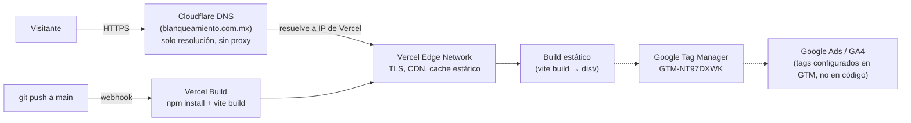

# Blanqueamiento Dental Center — Landing page

Sitio de marketing (una sola landing + páginas legales) para la clínica dental
"Blanqueamiento Dental Center" en CDMX. Pensado para campañas de Google Ads:
SEO on-page, datos estructurados, Google Tag Manager y páginas de privacidad/aviso
legal. No tiene backend propio ni base de datos — es un sitio estático.

- Producción: https://www.blanqueamiento.com.mx/

## Stack

| Capa | Tecnología |
|---|---|
| Framework | React 18 + TypeScript |
| Build tool | Vite (plugin `@vitejs/plugin-react-swc`) |
| UI | shadcn/ui sobre Radix UI, Tailwind CSS |
| Routing | React Router (`react-router-dom`) |
| Formularios | React Hook Form + Zod |
| Tests unitarios | Vitest + Testing Library (jsdom) |
| Tests E2E | Playwright (config lista, carpeta `e2e/` aún no creada) |
| Analytics | Google Tag Manager (`GTM-NT97DXWK`) vía `window.dataLayer` |
| Hosting | Vercel |
| DNS | Cloudflare (solo DNS, ver sección de seguridad) |

Ver [CLAUDE.md](CLAUDE.md) para comandos de desarrollo y el detalle de la
arquitectura del código (rutas, estructura de `src/`, etc.).

## Despliegue

El repo se construye y despliega automáticamente en **Vercel** en cada push a
`main` (build estático con `vite build`, servido como assets + rewrites de
Vercel). El dominio `blanqueamiento.com.mx` usa **Cloudflare** únicamente como
proveedor de DNS: los nameservers del dominio apuntan a Cloudflare
(`edward.ns.cloudflare.com`, `ximena.ns.cloudflare.com`), pero el registro no
está "proxied" (nube gris, no naranja) — los A/CNAME resuelven directo a la
red de Vercel, que es quien sirve el tráfico, la terminación TLS y el CDN/edge
cache. Cloudflare aquí no está actuando como WAF/CDN/proxy, solo como zona DNS.

Flujo de release: push/merge a `main` → Vercel detecta el webhook de GitHub →
corre `npm run build` → publica el `dist/` resultante en su edge network →
el dominio (resuelto vía Cloudflare DNS) sirve la versión nueva de inmediato,
sin pasos manuales.

## Capas de seguridad

Estado real verificado contra el sitio en producción (headers HTTP, DNS):

- **TLS/HTTPS**: terminado por Vercel, con `Strict-Transport-Security: max-age=63072000` (HSTS) en todas las respuestas — fuerza HTTPS en el navegador incluso si alguien entra por HTTP.
- **Redirect apex → www**: `blanqueamiento.com.mx` responde 308 hacia `www.blanqueamiento.com.mx`, evitando contenido duplicado y fijando un único origen canónico.
- **Superficie de ataque mínima**: al ser un sitio estático sin backend, sin base de datos y sin autenticación de usuarios, no hay endpoints de API, formularios con procesamiento server-side propio ni datos de clientes almacenados en este repo — se elimina toda una clase de vulnerabilidades (inyección SQL, auth rota, IDOR, etc.).
- **Sin secretos en el repo**: no hay `.env` ni credenciales versionadas; el único servicio de terceros integrado es Google Tag Manager (contenedor público `GTM-NT97DXWK`), sin API keys sensibles en el cliente.
- **DNS en Cloudflare, sin proxy activo**: al no estar "proxied", Cloudflare **no** aporta hoy WAF, mitigación DDoS ni ocultamiento de la IP de origen para este dominio — esa protección la da la red de Vercel directamente. Si se quiere una capa adicional de WAF/DDoS de Cloudflare, habría que activar el proxy (nube naranja) en el registro DNS.
- **Gaps detectados (no implementados actualmente)**: no se envían cabeceras `Content-Security-Policy`, `X-Frame-Options`/`frame-ancestors` ni `X-Content-Type-Options`. Al no haber CSP, un XSS vía script de terceros mal configurado no tendría una barrera adicional del navegador. Se puede agregar vía `vercel.json` (`headers`) si se quiere endurecer esto.
