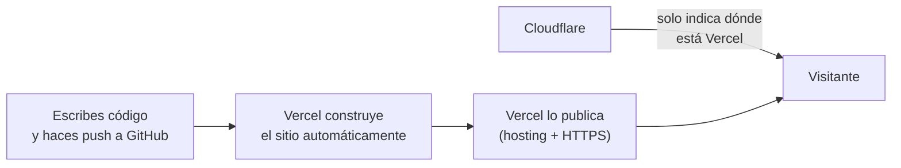

# Blanqueamiento Dental Center — Landing page

Landing page de marketing para la clínica dental "Blanqueamiento Dental
Center" en CDMX, pensada para campañas de Google Ads. Es un sitio 100%
estático: no tiene servidor propio ni base de datos.

- Producción: https://www.blanqueamiento.com.mx/

## Qué usa este proyecto

**Para construir el sitio:**
- React + TypeScript
- Vite (empaqueta y sirve el sitio)
- Tailwind CSS + shadcn/ui (estilos y componentes visuales)
- React Router (las páginas: inicio, privacidad, aviso legal)

**Para probarlo:**
- Vitest (pruebas rápidas de código)
- Playwright (pruebas simulando un usuario real en el navegador)

**Para publicarlo:**
- GitHub — aquí vive el código
- Vercel — construye el sitio y lo publica en internet
- Cloudflare — solo resuelve el nombre de dominio (`blanqueamiento.com.mx`)

**Servicios externos que usa el sitio:**
- Google Tag Manager — mide clics y conversiones para Google Ads
- Google Fonts — tipografías
- Google Maps — el mapa embebido de la ubicación
- WhatsApp — botón de contacto directo
- Notion Calendar — botón de "Agendar cita"

## Comandos de desarrollo

- `npm run dev` — levanta el sitio en local (puerto 8080).
- `npm run build` — genera la versión de producción.
- `npm run preview` — sirve esa versión ya construida.
- `npm run lint` — revisa el código con ESLint.
- `npm run test` — corre las pruebas.

> Nota: en el repo hay tanto `package-lock.json` como `bun.lock`. Antes de
> instalar dependencias nuevas, confirmar cuál de los dos se está usando.

## Cómo se publica (despliegue)

1. Haces push a la rama `main` en GitHub.
2. Vercel se entera automáticamente y construye el sitio.
3. Vercel publica la nueva versión — sin pasos manuales.
4. Cuando alguien visita `blanqueamiento.com.mx`, Cloudflare solo le dice
   "el sitio está en Vercel"; quien realmente entrega la página es Vercel.

## Seguridad, en simple

- **No hay nada que hackear "por dentro"**: al no tener servidor propio ni
  base de datos, no hay forma de robar información de clientes desde este
  código — no se guarda ninguna.
- **La conexión siempre es segura**: el sitio fuerza HTTPS (candado) en
  todos los casos, incluso si alguien escribe la dirección sin `https://`.
- **No hay contraseñas ni llaves secretas** guardadas en el código.
- **Los botones de contacto** (WhatsApp, teléfono, agendar cita) llevan al
  visitante directo a esos servicios — el sitio no procesa ni guarda esos
  datos.
- **Pendiente si se quiere más blindaje**: hoy Cloudflare solo resuelve el
  dominio, no filtra tráfico malicioso. Se puede activar como "proxy" para
  sumar esa protección extra si en el futuro se necesita.
